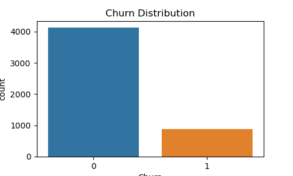
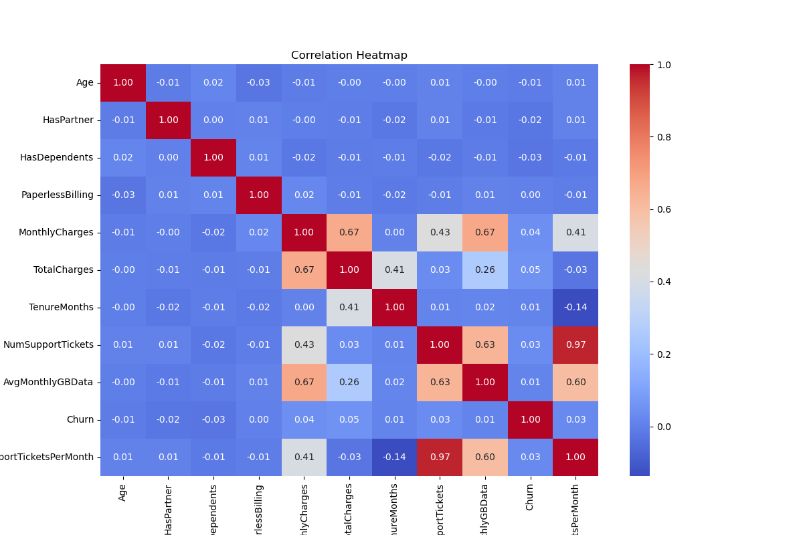
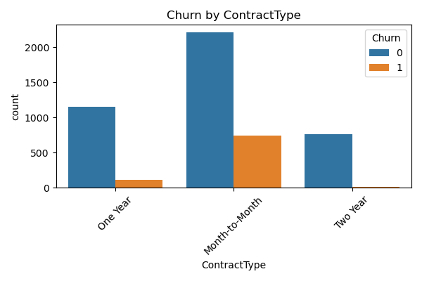

# ConnectSphere: Customer Churn Prediction & Marketing Segmentation

An end-to-end marketing analytics project on a fictional telecom subscriber base (**ConnectSphere**): messy multi-source data cleaned and merged, exploratory churn analysis, customer segmentation via multiple unsupervised methods, churn prediction with explainable ML, and a Tableau dashboard for stakeholder consumption.

## Overview

Three intentionally "dirty" source files — customer demographics, account/billing details, and usage/churn history — are cleaned, standardized, and joined into a single base table. From there, the project runs two parallel analytical tracks:

1. **Customer segmentation** — who are the distinct customer archetypes, and how do they differ in value and churn risk?
2. **Churn prediction** — which customers are likely to leave, and what's driving it?

Both feed into a Tableau dashboard built for a non-technical marketing audience.

## Data

| File | Contents |
|---|---|
| `data/raw/customers_dirty.csv` | Demographics: age, gender, location, partner/dependents |
| `data/raw/accounts_dirty.csv` | Contract type, subscription plan, payment method, billing |
| `data/raw/usage_churn_dirty.csv` | Monthly usage, support tickets, churn label |
| `data/processed/cleaned_base_table.csv` | Cleaned, merged, feature-engineered base table |

Full field-level documentation, including the deliberately dirty value patterns each column contains: [`reports/data-dictionary.docx`](reports/data-dictionary.docx).

Cleaning involved whitespace/casing normalization (`Gender`, `Location`), boolean standardization (`HasPartner`, `PaperlessBilling` arriving as `Yes/No/True/False/1/0` mixes), missing-value imputation (`TotalCharges` backfilled from `MonthlyCharges × TenureMonths`), and inner-joining all three sources on a whitespace-dirty `CustomerID` key.

## Exploratory analysis

Churn distribution, correlation structure, and univariate/bivariate breakdowns against every key feature (tenure, charges, support tickets, contract type, plan, payment method, location):

<p float="left">
  
  
  
</p>

Full set of plots in [`eda/`](eda/); an automated profiling pass is in [`eda/sweetviz_report.html`](eda/sweetviz_report.html) (download and open locally — GitHub won't render it inline).

## Customer segmentation

Five dimensionality-reduction techniques (PCA, UMAP, Truncated SVD, Isomap, t-SNE) were each paired with clustering (KMeans, Agglomerative, DBSCAN) and scored on internal validity metrics:

| Model | Silhouette ↑ | Calinski-Harabasz ↑ | Davies-Bouldin ↓ | Mean Intra-Cluster Dist. |
|---|---|---|---|---|
| DBSCAN + PCA | **0.876** | 3953.6 | **0.496** | 1.122 |
| Agglomerative + PCA | 0.481 | **5920.9** | 0.645 | 0.750 |
| KMeans + UMAP | 0.352 | 2729.2 | 0.987 | 2.488 |

Full metrics: [`clustering/clustering_metrics_summary_extended.csv`](clustering/clustering_metrics_summary_extended.csv).

The final four-segment solution, with churn rate by segment:

| Segment | Key Traits | Churn Rate |
|---|---|---|
| **Loyal Low-Usage Seniors** | Longest tenure, low spend, very few support tickets | 48.4% |
| **Demanding Premium Users** | Highest usage & bills, most support contact, most profitable | 47.8% |
| **Young Newcomers** | Shortest tenure, youngest, moderate usage | 53.3% |
| **Senior Budget Users** | Oldest, lowest total spend, low engagement | 47.9% |

Each segment comes with a distinct retention strategy (loyalty perks for seniors, premium support for power users, onboarding nudges for newcomers). Full segment narratives and strategy notes: [`reports/customer-segmentation-report.docx`](reports/customer-segmentation-report.docx).

## Churn prediction

Modeled as a supervised classification problem on the cleaned base table (with cluster membership as a feature):

- **Baselines → ensembles**: Logistic Regression, Random Forest, XGBoost, and a Voting ensemble
- **AutoML**: PyCaret classification experiment for rapid model comparison
- **Imbalance handling**: SMOTE oversampling, since churn/non-churn is not evenly split
- **Hyperparameter tuning**: Optuna
- **Explainability**: SHAP values on the XGBoost model to identify the top churn drivers

## Tableau dashboard

[`tableau/marketing-analytics-dashboard.twbx`](tableau/marketing-analytics-dashboard.twbx) — a packaged Tableau workbook translating the segmentation and churn findings into an interactive, stakeholder-facing view. Open with [Tableau Desktop](https://www.tableau.com/products/desktop) or [Tableau Public](https://public.tableau.com/).

## Repo structure

```
.
├── README.md
├── requirements.txt
├── data/
│   ├── raw/                  # original dirty source files
│   └── processed/            # cleaned_base_table.csv
├── notebooks/
│   └── final.ipynb           # cleaning → EDA → segmentation → churn modeling
├── eda/                      # exported EDA plots + Sweetviz profiling report
├── clustering/                # clustering model comparison metrics
├── reports/
│   ├── data-dictionary.docx
│   └── customer-segmentation-report.docx
└── tableau/
    └── marketing-analytics-dashboard.twbx
```

## Stack

Python (pandas, NumPy, scikit-learn, XGBoost, UMAP, imbalanced-learn, PyCaret, Optuna, SHAP, missingno, Sweetviz) · Tableau

To run the notebook locally: `pip install -r requirements.txt` and open `notebooks/final.ipynb`.
